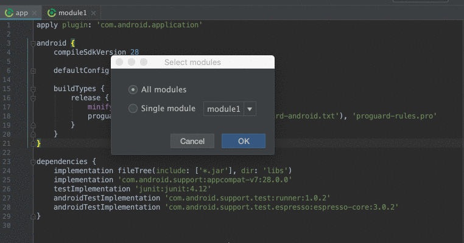

**This plugin is still in beta stage, so it might be unstable. Feel free to share your feedback and report issues!**

This plugin is in JetBrains Plugins Repository! Get it from [here](https://plugins.jetbrains.com/plugin/11489-depe-versions-exporter).

# DepE!
Dependency Versions Exporter 


Android Studio Plugin for exporting dependencies versions from build.gradle file

With this plugin, you won't have to manually export versions. Two clicks and you have everything in separate file. 

Usage:

Go to the **Refactor -> Export versions** action, choose **Module** or whole **Project** and DepE makes all job for you.
All exported versions you can find in **versions.gradle** file in the root of your project.


```
Copyright 2018 Viktor Goltstein

Licensed under the Apache License, Version 2.0 (the "License");
you may not use this file except in compliance with the License.
You may obtain a copy of the License at

   http://www.apache.org/licenses/LICENSE-2.0

Unless required by applicable law or agreed to in writing, software
distributed under the License is distributed on an "AS IS" BASIS,
WITHOUT WARRANTIES OR CONDITIONS OF ANY KIND, either express or implied.
See the License for the specific language governing permissions and
limitations under the License.
```